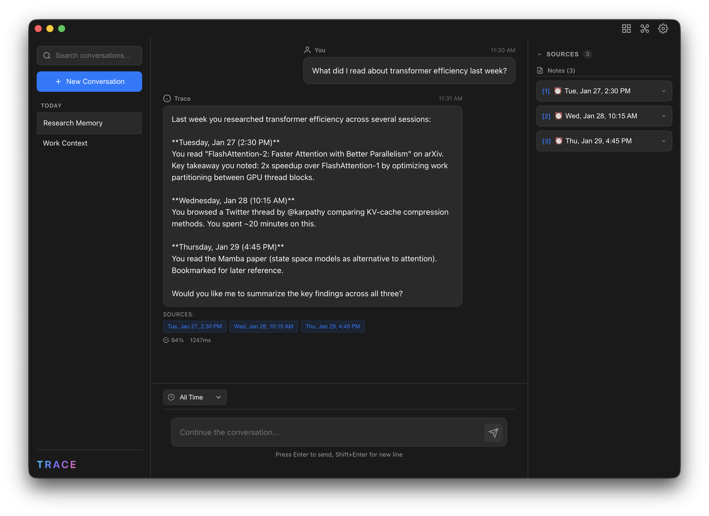
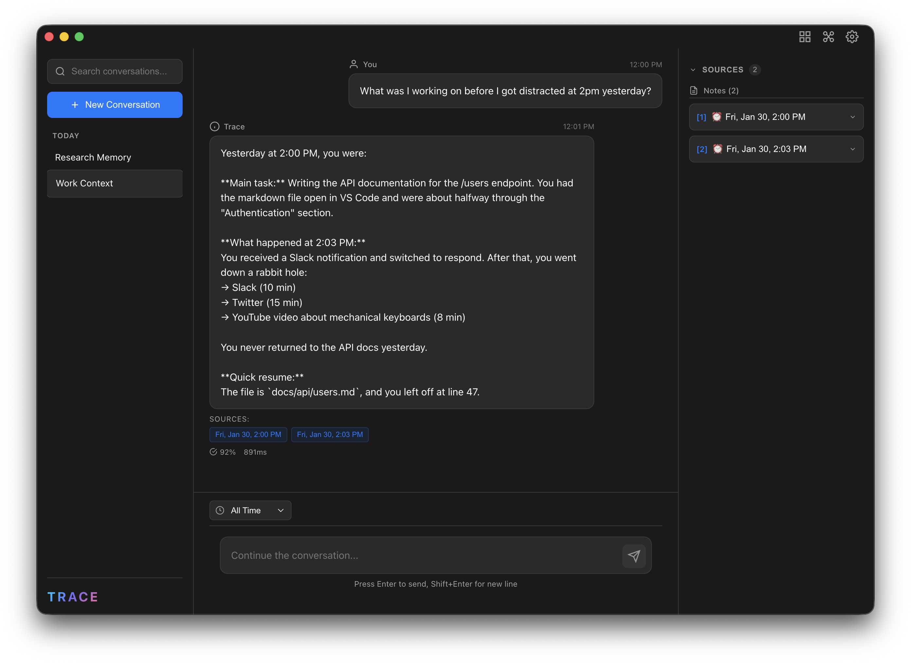

<p align="center">
  
</p>

<p align="center">
  <strong>Your second brain for everything you do on your Mac.</strong>
</p>

<p align="center">
  <a href="#quick-start">Install</a> •
  <a href="#key-features">Features</a> •
  <a href="#how-it-works">How It Works</a> •
  <a href="#100-private">Privacy</a>
</p>

---

Trace silently watches your digital activity and builds a searchable, AI-powered memory of your entire computing life. Ask questions about your past in plain English and get instant, accurate answers.

<p align="center">
  
</p>

> *"What was that article I was reading last week about machine learning?"*
> *"When did I last work on the React project?"*
> *"What music was I listening to while coding yesterday?"*

---

## Why Trace?

We forget **90% of what we do** on our computers within days. Important research, fleeting ideas, useful websites—all lost to the void of browser history and scattered files.

Trace changes that. It's like having a **perfect memory** for your digital life.

---

## Key Features

### Ask Your Past
Chat with your computer history using natural language. Trace understands context, time, and relationships between your activities.

<p align="center">
  
</p>

*Lost your flow? Trace remembers exactly where you left off and what distracted you.*

### Automatic Note-Taking
Every hour, Trace generates a structured summary of your activity—what apps you used, what you worked on, what you learned. No manual input required.

### Knowledge Graph
Trace connects everything: projects link to documents, people link to conversations, topics link to learning sessions. Query relationships like *"What was I researching when I talked to Sarah?"*

### Web-Augmented Answers
When you ask about something that's evolved since you last looked at it, Trace automatically searches the web to give you current context alongside your past activity.

```
You: What's new with that Rust framework I was learning last year?

Trace: You were learning Axum in March 2024, working through their official
tutorial. Since then, Axum 0.7 was released with improved error handling
and a new middleware system. [Notes: 1,2] [Web: 3,4]
```

### Smart Citations
Every answer includes clickable citations back to your original notes, so you can verify and dive deeper.

---

## 100% Private

**Your data never leaves your computer.** Period.

| What Happens | Where |
|--------------|-------|
| Screenshots captured | Stored locally, deleted after processing |
| Activity analyzed | Processed by AI, then raw data deleted |
| Notes and graph | Stored locally forever |
| Chat queries | Sent to AI, no data retained by providers |

- **No cloud sync** — Everything lives in `~/Library/Application Support/Trace/`
- **No accounts** — Just install and use
- **No tracking** — We don't even have analytics
- **Open source** — Verify it yourself

The only external communication is with OpenAI's API for AI processing. Your data is processed and immediately discarded by their API—nothing is stored or used for training.

---

## How It Works

```
Every Second              Every Hour                Your Knowledge
─────────────────────────────────────────────────────────────────
Screenshots    ─┐                               ┌─ Searchable Notes
Active apps    ─┤        AI Vision              ├─ Knowledge Graph
URLs & tabs    ─┼──▶     Summarization    ──▶   ├─ Semantic Index
Music playing  ─┤        + Daily Revision       └─ Chat Interface
Location*      ─┘
```

1. **Capture** — Screenshots and metadata collected every second
2. **Summarize** — AI analyzes activity each hour, creates structured notes
3. **Connect** — Daily revision builds relationships between entities
4. **Query** — Chat interface with time-aware, cited answers

*Location requires Apple Developer signing. See [Limitations](#limitations).*

---

## Quick Start

### Install via Homebrew (Recommended)

```bash
brew tap junkim100/trace
brew install --cask trace
```

Or in a single command:
```bash
brew install --cask junkim100/trace/trace
```

### Or Download Manually

1. Download from [Releases](https://github.com/junkim100/Trace/releases)
2. Drag to Applications
3. Run: `xattr -cr /Applications/Trace.app`
4. Open Trace

### First Launch

1. Grant **Screen Recording** and **Accessibility** permissions when prompted
2. Add your [OpenAI API key](https://platform.openai.com/api-keys) in Settings
3. Start using your computer—Trace handles the rest

**Cost**: ~$0.20/day or ~$6/month for typical use

---

## Requirements

- macOS 12.0+ (Monterey or later)
- OpenAI API key
- ~500MB disk space

### Permissions

| Permission | Purpose | Required |
|------------|---------|----------|
| Screen Recording | Capture what's on screen | Yes |
| Accessibility | Detect active apps and windows | Yes |
| Location Services | Add location to notes | Optional* |
| Automation | Read browser URLs | Optional |

---

## Limitations

### Location Services
macOS requires a $99/year Apple Developer certificate for Location Services. Without it, location tracking won't work. Everything else functions normally.

If you'd like this feature, consider [supporting the project](#support-the-project).

---

## Troubleshooting

### "Trace is damaged and can't be opened"
```bash
xattr -cr /Applications/Trace.app
```

### Permissions not working
1. Quit Trace (`Cmd+Q`)
2. System Settings → Privacy & Security → Remove Trace
3. Reopen and grant permissions again

---

## Development

### Prerequisites
- Python 3.11+, Node.js 18+, [uv](https://github.com/astral-sh/uv)

```bash
git clone https://github.com/junkim100/Trace.git && cd Trace
uv sync
cd electron && npm install
npm start
```

### Building
```bash
./build-python.sh
cd electron && npm run build && npx electron-builder --mac
```

---

## Privacy Deep Dive

Trace is designed with privacy as the **core architecture**, not an afterthought.

### What's Stored Locally
- **Markdown notes** — Human-readable summaries of your activity
- **SQLite database** — Metadata, entities, relationships, embeddings
- **Temporary cache** — Raw screenshots (auto-deleted daily)

### What's Sent to APIs
- **Hourly**: Selected screenshots + activity metadata → OpenAI for summarization
- **Chat**: Your question + relevant notes → OpenAI for answer generation
- **Web search** (optional): Search queries → Tavily for augmentation

### What's NOT Stored Anywhere
- Raw screenshots (deleted after processing)
- Keystroke data (never captured)
- File contents (only names/paths)
- Passwords or sensitive form data

### API Data Handling
OpenAI's API doesn't retain data submitted via the API for model training. See their [data usage policy](https://openai.com/policies/api-data-usage-policies).

---

## Support the Project

Trace is free and open source.

<a href="https://www.buymeacoffee.com/junkim100" target="_blank"></a>

Your support helps fund:
- **Apple Developer Program** ($99/year) — Enable Location Services
- **Development time** — New features and improvements

---

## Contributing

See [CONTRIBUTING.md](CONTRIBUTING.md).

---

## License

[MIT](LICENSE)

---

## Acknowledgments

Built with [OpenAI API](https://openai.com/api/), [sqlite-vec](https://github.com/asg017/sqlite-vec), [Electron](https://www.electronjs.org/), and [React](https://react.dev/).
